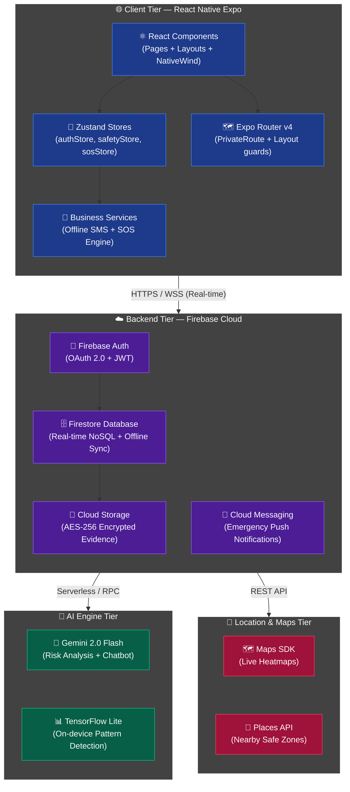
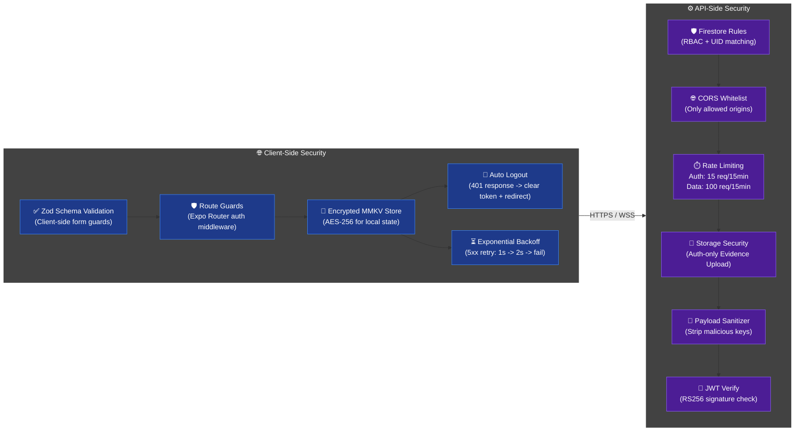
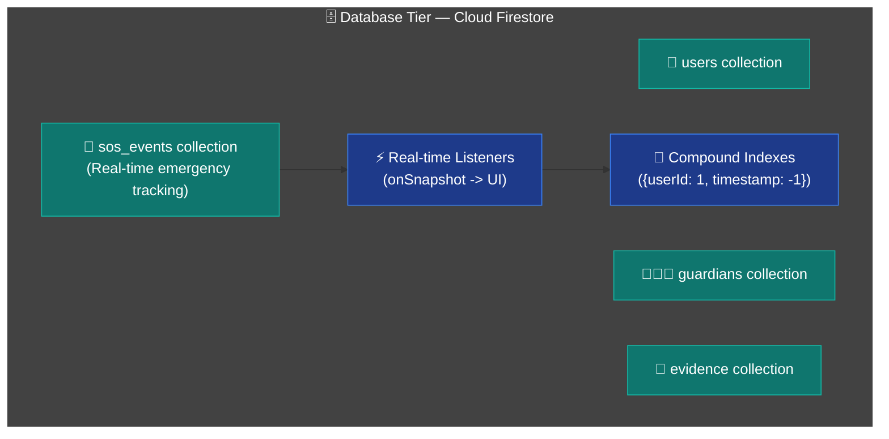

<p align="center">
  
</p>

<h1 align="center">SafeSphere AI</h1>
<h3 align="center"><code>Predict. Protect. Prevent.</code></h3>

<p align="center">
  <b>A Zero-Trust, Predictive Safety Ecosystem</b><br/>
  <sub>Next-generation intelligent safety platform leveraging Edge AI and zero-touch triggers.</sub>
</p>

<br/>

<p align="center">
  
  
  
  
</p>

---

## 🌑 The Dark Reality (The Problem)

Imagine walking alone on an unfamiliar, dimly lit street at 11 PM. You hear footsteps behind you. Panic sets in. Your heart races. In that terrifying, high-adrenaline moment, the **last thing you are capable of doing** is pulling out your phone, unlocking the screen, navigating to a safety app, and holding down an SOS button.

By the time you manage to do that, it is often too late. 

Current women's safety applications are fundamentally flawed because they are **purely reactive**. They assume the victim has the time, composure, and physical freedom to interact with their device during a physical threat or harassment. They act as digital pagers rather than active shields, failing when they are needed the absolute most.

---

## 💡 The Paradigm Shift (Our Solution)

**SafeSphere AI** removes the burden of action from the victim. It shifts the paradigm from *reactive panic* to **predictive intelligence and autonomous response**.

We built a platform that acts as a digital bodyguard. It analyzes your environment before a threat materializes, and if an attack occurs, it triggers **zero-touch interventions**. You don't need to touch your screen. SafeSphere knows when you are in danger and acts for you.

---

## ✨ Core Capabilities

### 1. Predictive Risk Engine
Instead of waiting for an emergency, the system calculates a real-time **Safety Score (0-100)** using high-frequency telemetry data:
- **Spatial:** Live GPS against crowd-sourced crime heatmaps.
- **Environmental:** Ambient light sensor data and time-of-day.
- **Behavioral:** Accelerometer motion patterns and travel speed anomalies.

### 2. Multi-Modal Zero-Touch SOS
When physical interaction with a device is compromised, SafeSphere provides alternative, invisible triggers:
- **Voice Recognition:** Always-listening local ML model detecting distress keywords (`"Help"`, `"Stop"`).
- **Inertial Triggers:** High-G accelerometer shake detection.
- **Hardware Gestures:** Volume button sequence mapping.

### 3. Autonomous Legal Evidence Collection
Upon emergency activation, the system bypasses user interaction to secure verifiable, tamper-proof evidence:
- Simultaneous front/back camera photo capture.
- Continuous audio/video recording.
- **Instant Cloud Sync:** AES-256 encrypted payloads uploaded immediately to prevent data loss if the device is destroyed.

### 4. Guardian Telemetry Dashboard
Authorized contacts receive real-time access to a low-latency dashboard featuring:
- High-precision GPS tracking.
- Device health (Battery %, Network strength).
- Live Safety Score and activity status.

---

## 🏗️ System Architecture

The platform operates on a **4-tier architecture** spanning the mobile client, Firebase serverless backend, AI processing layer, and Google Maps cluster. Every component is purpose-built for high-throughput safety analytics at scale:



---

## 🔒 Security Architecture

The platform implements a **Zero-Trust, Defense-in-Depth** security model across both client and server tiers:



---

## 🗄️ Database Tier — Firestore NoSQL



---

## 💻 Tech Stack Highlights

| Layer | Technology | Purpose |
|-------|------------|---------|
| **Core Framework** | React Native + Expo | Cross-platform mobile architecture |
| **State Management** | Zustand + React Query | Predictable local and server state sync |
| **Styling Engine** | NativeWind (Tailwind CSS) | Utility-first, performant glassmorphism |
| **Cloud Backend** | Firebase (Firestore/Auth/Storage) | Real-time NoSQL and scalable auth |
| **AI Processing** | Gemini 2.0 Flash + TF Lite | Millisecond-latency risk analysis |
| **Geolocation** | Google Maps Platform | Routing, Heatmaps, and Safe Zones |

---

## 🚀 Setup & Local Development

### Prerequisites
- Node.js `v18+`
- Expo CLI
- Firebase Project with Firestore & Storage enabled

### Installation

1. **Clone the repository:**
   ```bash
   git clone https://github.com/your-org/Infinity_Coders-v2v.git
   cd Infinity_Coders-v2v
   npm install
   ```

2. **Configure Environment:**
   ```bash
   cp .env.example .env
   # Add your API keys to .env
   ```

3. **Start Development Server:**
   ```bash
   npx expo start
   ```

---

<p align="center">
  <sub>Designed and engineered for maximum reliability. Built by <b>Infinity Coders</b>.</sub>
</p>
